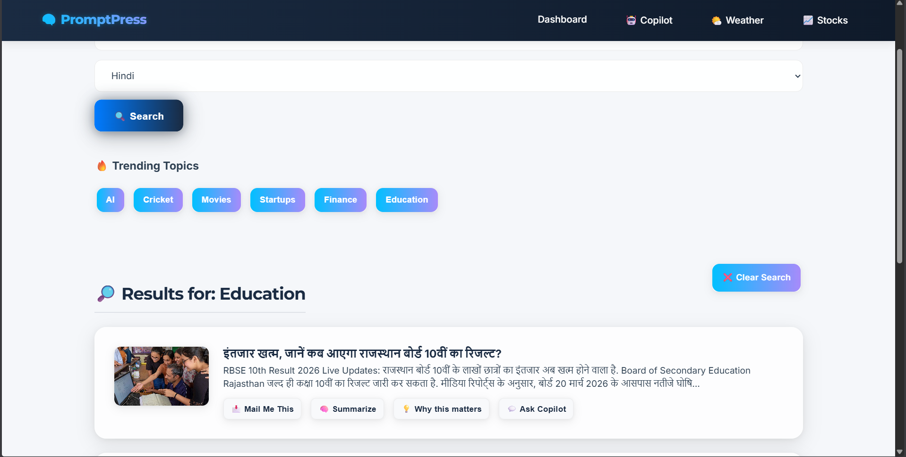
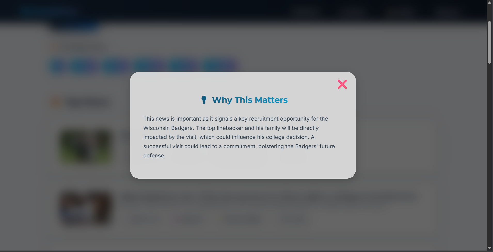
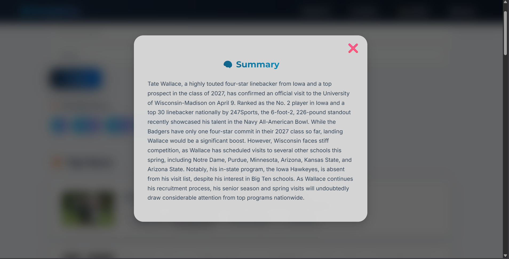
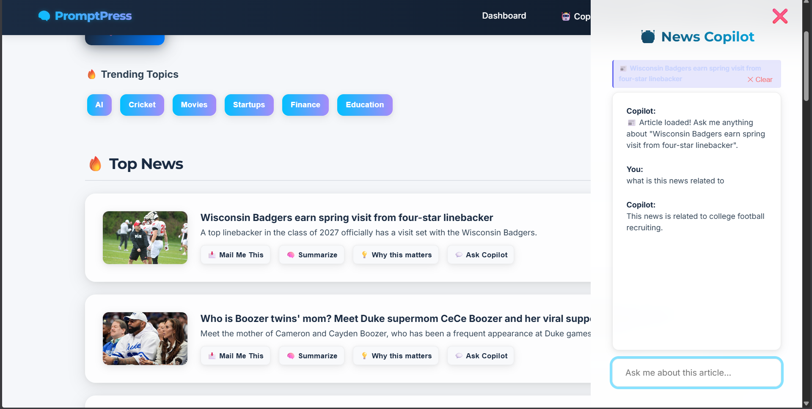
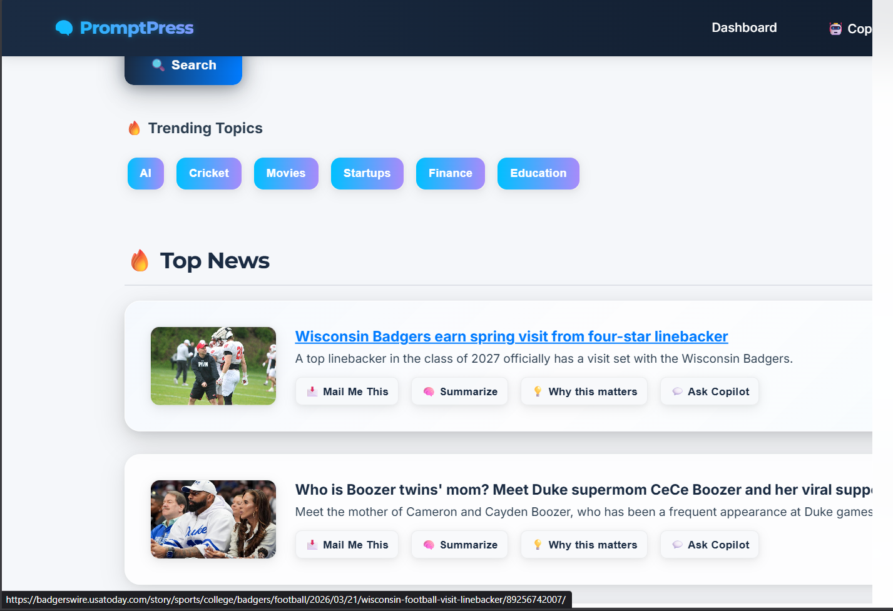
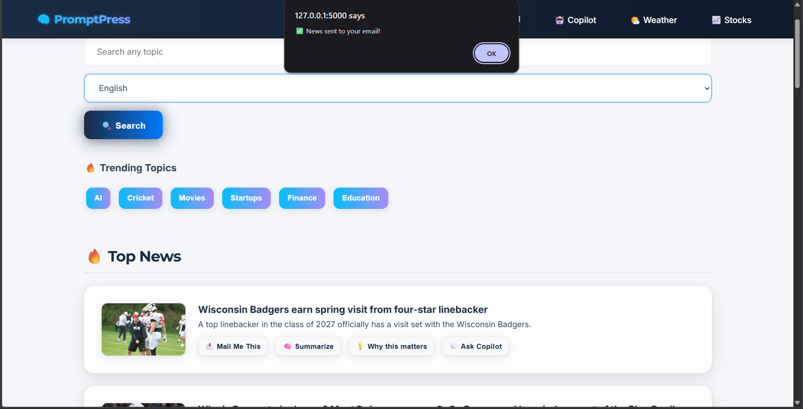

# 📰 PromptPress — AI News Intelligence Platform

PromptPress is a GenAI-powered news platform that transforms how users interact with news — shifting from passive reading to intelligent understanding.

Instead of just showing headlines, PromptPress helps users understand **why news matters**, explore related stories, and interact with content using AI.

---

## 🚀 Overview

Modern news platforms focus on delivering content, but not helping users understand it. PromptPress introduces a **context-first, user-controlled GenAI approach** to news consumption.

Users can:
- Quickly grasp the context of a news article  
- Generate insights about its importance  
- Ask questions grounded in the article  
- Explore related news for broader understanding  

---

## ✨ Core Features

### 📰 Real-Time News Dashboard
- Live news aggregation based on categories  
- Clean and responsive interface  

---

### 🌐 Language-Based News Filtering



- Filter news based on preferred language  
- Enhances accessibility and personalization  

---

### 💡 AI Insight Layer (Why This Matters)



- Explains **why a news article matters**  
- Highlights impact and relevance in 2–3 lines  

---

### 🧠 On-Demand Summarization



- Generate summaries only when needed  
- Preserves original context  

---

### 🤖 Article-Aware Chatbot



- Answers questions **strictly based on the article**  
- Reduces hallucination using contextual grounding  

---

### 🔗 Related News



- Connects similar articles  
- Helps users understand evolving stories  

---

### 📩 Mail Me This



- Instantly send selected news to email  

---

### 🌦️ Weather & 📈 Stocks Insights


- Provides simple AI-generated explanations  
- Converts raw data into meaningful insights  

---

## 🧠 GenAI Capabilities

PromptPress uses GenAI in a **focused and responsible way**:

- Insight generation (why it matters)  
- Context-aware question answering  
- On-demand summarization  
- Lightweight reasoning across articles  

> AI is **user-controlled**, not automatic.

---

## 🏗️ System Flow

```
News API → Context Layer → GenAI Layer → User Interaction → Output
```

1. Fetch real-time news from APIs  
2. Display contextual preview  
3. Apply GenAI features on demand  
4. Return insights, summaries, and answers  

---

## 🛠️ Tech Stack

- Backend: Flask (Python)  
- Frontend: HTML, CSS, JavaScript  
- AI Layer: Large Language Models (LLMs)  
- News API  
- OpenWeather API  
- Alpha Vantage API  
- Gmail SMTP  

---

## ⚙️ Setup Instructions

### 1. Clone Repository
```bash
git clone https://github.com/your-username/promptpress-ai-news-intelligence.git
cd promptpress-ai-news-intelligence
```

### 2. Create Virtual Environment
```bash
python -m venv venv
source venv/bin/activate        # Windows: venv\Scripts\activate
```

### 3. Install Dependencies
```bash
pip install -r requirements.txt
```

### 4. Configure Environment Variables

Create a `.env` file:

```env
EMAIL_ADDRESS=your_email
EMAIL_PASSWORD=your_app_password
NEWS_API_KEY=your_key
COHERE_API_KEY=your_key
GROQ_API_KEY=your_key
OPENWEATHER_API_KEY=your_key
ALPHAVANTAGE_API_KEY=your_key
```

### 5. Run Application
```bash
python app.py
```

Open in browser:
```
http://127.0.0.1:5000
```

---

## 📊 Evaluation

- Insight clarity and usefulness  
- Summary accuracy  
- Chatbot response correctness  
- User interaction metrics  
- System performance  

---

## 🌱 Future Scope

- Multi-language expansion  
- Advanced story tracking  
- Personalized recommendations  
- Domain-specific intelligence  

---

## 🏆 What Makes It Unique

- Focus on **understanding, not just summarization**  
- Human-in-the-loop AI interaction  
- Grounded responses to reduce hallucination  
- Lightweight, scalable, and buildable system  

---

## 👤 Author

**Jivitesh**  
ET AI Hackathon 2026  

- GitHub: https://github.com/jiviteshh  
- LinkedIn: https://linkedin.com/in/naragam-jivitesh-71a4b8313  

---

## ⭐ Final Thought

> PromptPress transforms news from information overload into intelligent understanding.

If you found this project useful, consider giving it a ⭐
